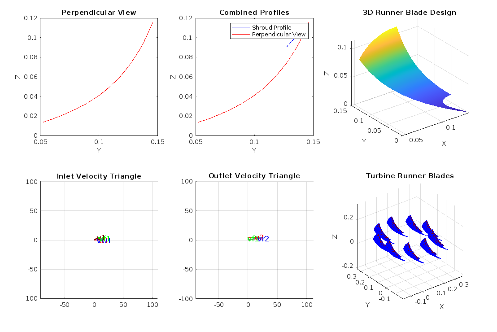

# Francis-Runner-project-077BME

## Project Overview
This project is submitted as part of the academic requirements for the Fluid Machines course in the 5th semester of the Bachelor of Mechanical Engineering program at Pulchowk Campus.

## Introduction
The Francis turbine is a pivotal component in hydropower generation. The runner, a critical element connected to the electrical generator's shaft, plays a crucial role in the turbine's performance. The goal of this project is to model the blade profile and runner of the Francis turbine.

Based on the given input parameters: net head, discharge rate, and speed of the runner, we calculate the inlet and outlet parameters. The implementation of the Bovet Method is facilitated through computational tools, particularly MATLAB. 

## Input Parameters and Calculations

| Parameter | Symbol | Given Value | Calculation Method |
|-----------|--------|-------------|-------------------|
| Discharge | Q | 0.3 m³/s | Provided input |
| Net Head | H | 15 m | Provided input |
| Runner Speed | nr | 1500 rpm | Provided input |
| Specific Speed (ns) | ns | Calculated | ns = (nr * √P) / (H^(5/4)) |
| Power | P | Calculated | P = η * ρ * g * Q * H |
| Diameter at Inlet (d1) | d1 | Calculated | Based on specific speed |
| Diameter at Outlet (d2) | d2 | Calculated | Based on specific speed |
| Blade Height | h1, h2 | Calculated | Derived from geometric relationships |

## Design Methodology
The project employs the Bovet Method to:
- Calculate geometric parameters of the runner
- Determine blade profile characteristics
- Generate multiple view representations

## Visualizations
The project generates comprehensive visualizations including:
- Blade profile geometry
- Velocity triangles
- Runner blade arrangement
- Axial and meridional views

## Output

## Key Visualizations
1. **Perpendicular View**: Shows the blade profile from a perpendicular perspective
2. **Combined Profiles**: Displays shroud and hub profiles
3. **3D Runner Blade Design**: Comprehensive three-dimensional representation
4. **Velocity Triangles**: 
   - Inlet velocity triangle
   - Outlet velocity triangle
5. **Turbine Runner Blades**: Circular arrangement of runner blades

## Methodology Highlights
- Used computational techniques to model runner geometry
- Applied Bovet Method for design calculations
- Generated multiple view representations
- Analyzed geometric and flow characteristics

## Project Contributors
- Balkrishna Poudel(077BME005)
- Biswash Khatiwada(077BME014)
- Hari Prasad Gajurel(077BME053)
- Ravin Purbey(077BME030)

## Course
Fluid Machines (5th Semester / B.E / Mechanical Engineering / Pulchowk Campus / IOE / TU)

## Disclaimer
This is an academic project demonstrating the design principles of a Francis turbine runner.